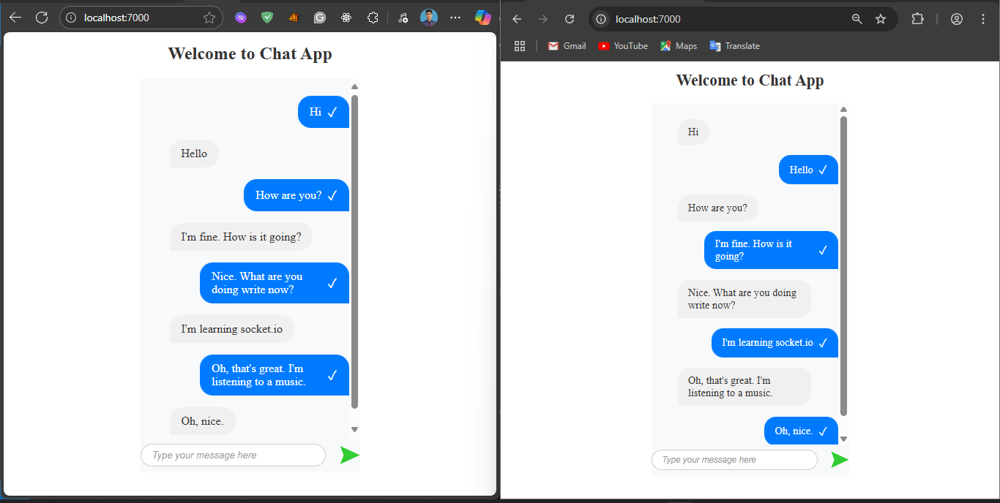

# Web Socket Foundation with ChatApp Example

A foundational project showcasing a real-time chat application built with [Socket.IO](https://socket.io/) and [Express](https://expressjs.com/). This example demonstrates the core principles of web sockets, event-driven communication, and modern UI practices for messaging apps.

## Features

- Real-time messaging between multiple users
- Delivery status indicator for sent messages
- Modern, responsive chat interface
- Built with Node.js, Express, and Socket.IO

## UI Sample



## Getting Started

### Prerequisites

- [Node.js](https://nodejs.org/) (v18 or higher recommended)
- [npm](https://www.npmjs.com/)

### Installation

1. Clone the repository:

   ```sh
   git clone https://github.com/cshosain/web-socket-foundation-with-ChatApp-example.git
   cd web-socket-foundation-with-ChatApp-example
   ```

2. Install dependencies:

   ```sh
   npm install
   ```

3. Start the server:

   ```sh
   node index.js
   ```

4. Open your browser and navigate to [http://localhost:7000](http://localhost:7000)

## Project Structure

```
├── index.js
├── package.json
├── public
│   ├── index.html
│   ├── style.css
│   └── Ui-sample.png
├── readme.md
```

## License

This project is licensed under the ISC License.

---

**Author:** Md.Hosain
